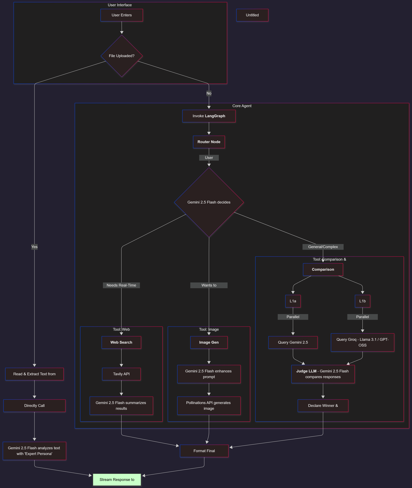

# 🧠 AI Agent Workshop

[](https://www.python.org/downloads/)
[](https://streamlit.io)
[](https://opensource.org/licenses/MIT)
[](https://mutimodal.streamlit.app/)
# ✨ Try the Live Demo
**[AGENTIC_MIND 🧠](https://mutimodal.streamlit.app/)**
---
An advanced multi-tool AI agent built with Streamlit and LangGraph. This interactive web application serves as a workshop to demonstrate and test the capabilities of a modern AI agent that can search the web, generate images, perform comparative analysis between models, and analyze user-uploaded files.

## ✨ Features

-   **🤖 Agentic Router:** A central LangGraph agent that intelligently routes user queries to the most appropriate tool.
-   **Interactive Debugging:** Integrated AGDebugger to provide a visual, interactive dashboard for monitoring, stepping through, and debugging the LangGraph agent's workflow and internal decisions.
-   **🌐 Real-Time Web Search:** Utilizes the Tavily API to fetch current information from the internet and provides summarized, relevant answers.
-   **🎨 AI Image Generation:** Integrates with the Pollinations AI API to generate images from user prompts, first enhancing the prompts with Gemini for more artistic results.
-   **⚖️ Dual-Model Comparison & Evaluation:** A unique tool that runs the same query on both **Google's Gemini 2.5 Flash** and a model via the **Groq API** (Llama 3.1 or GPT-OSS). A "Judge" LLM then evaluates both responses to determine the winner.
-   **📂 Advanced File Analysis:**
    -   Supports various file types (`.pdf`, `.txt`, `.py`, `.js`, etc.).
    -   Features an **OCR fallback** for PDFs without a text layer.
    -   Uses a powerful Gemini model with an "Expert Persona" to provide in-depth analysis, code reviews, or document summaries.
-   **📊 Live Performance Dashboard:** The sidebar provides real-time metrics on agent performance, including total requests, average latency, tool usage distribution, and user feedback accuracy.

## ⚙️ Architecture & Workflow

The application operates on two primary workflows, determined by whether a file is uploaded.

1.  **File Analysis Path:** A direct, non-agentic path where uploaded file content is processed and sent directly to the `file_analysis_tool`.
2.  **Core Agent Path:** When no file is present, the query is handled by the LangGraph agent, which routes it to the appropriate tool (Web Search, Image Gen, or Comparison).



## 🛠️ Tech Stack

-   **Frontend:** [Streamlit](https://streamlit.io/)
-   **AI Orchestration:** [LangChain](https://www.langchain.com/) & [LangGraph](https://langchain-ai.github.io/langgraph/)
-   **Language:** Python
-   **Core Libraries:** Pandas, Pillow, PyPDF2, PyMuPDF (fitz), Pytesseract
-   **APIs & Services:**
    -   **LLMs:** Google Gemini, Groq API (Llama, OpenAI models)
    -   **Web Search:** Tavily AI
    -   **Image Generation:** Pollinations AI

## 🚀 Getting Started

Follow these instructions to set up and run the project locally.

### 1. Prerequisites

-   Python 3.9 or higher
-   Git
-   **Tesseract OCR Engine:** This is a system-level dependency required for the file analysis tool's OCR fallback.
    -   Follow the official installation guide for your operating system: [Tesseract at UB Mannheim](https://github.com/UB-Mannheim/tesseract/wiki)
    -   Make sure to add the Tesseract executable to your system's PATH.

### 2. Clone the Repository

```bash
git clone <YOUR_REPOSITORY_URL>
cd <YOUR_PROJECT_DIRECTORY>
```


### 3. Set Up a Virtual Environment

It's highly recommended to use a virtual environment to manage dependencies.

```bash
# For macOS/Linux
python3 -m venv venv
source venv/bin/activate

# For Windows
python -m venv venv
.\venv\Scripts\activate
```
### 4. Install Dependencies

Create a `requirements.txt` file in your project root with the following content:

```text
streamlit
pandas
Pillow
PyPDF2
PyMuPDF
pytesseract
requests
langchain-google-genai
langchain
langgraph
tavily-python
pip install -r requirements.txt
```
### 5. Configure API Keys

The application uses Streamlit Secrets for managing API keys.

1.  Create a folder named `.streamlit` in your project's root directory.
2.  Inside this folder, create a file named `secrets.toml`.
3.  Add your API keys to this file in the following format:

```toml
# .streamlit/secrets.toml

# Google Gemini API Key
GOOGLE_API_KEY = "YOUR_GOOGLE_API_KEY_HERE"

# Groq API Key
GROQ_API_KEY = "YOUR_GROQ_API_KEY_HERE"

# Tavily Search API Key
TAVILY_API_KEY = "YOUR_TAVILY_API_KEY_HERE"

# Pollinations.ai Token (Optional, can be used without one)
POLLINATIONS_TOKEN = "YOUR_POLLINATIONS_TOKEN_HERE"
```
## ▶️ How to Run the Application

Once you have completed the setup, run the following command in your terminal from the project's root directory:

```bash
streamlit run streamlit_app.py
